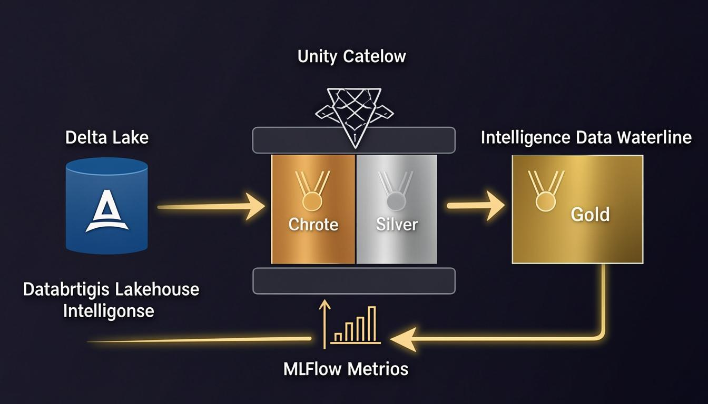
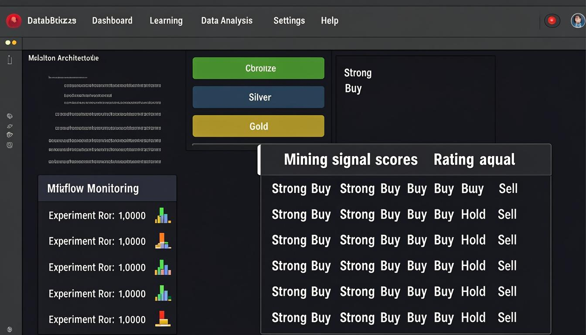

# 🏔️ Databricks Lakehouse Intelligence Suite

**Medallion Architecture + Unity Catalog + MLflow on Databricks**

<p align="center">
  
</p>

<p align="center">
  
  
  
  
  
</p>

---

## Overview

The **Lakehouse Intelligence Suite** is a production-grade mining & metals analytics platform built entirely on Databricks Free Edition using Serverless compute. It implements the full **Medallion Architecture** (Bronze → Silver → Gold) with Unity Catalog governance, MLflow experiment tracking, and SQL analytics dashboards to produce actionable intelligence scores for mining companies.

This project processes real mining company data — production volumes, all-in sustaining costs (AISC), and financial metrics — through quality-controlled pipeline stages to generate composite signal scores across five dimensions: Grade, Cost, Production, Growth, and ESG. The entire workspace is provisioned and managed programmatically via the Databricks REST API v2.0/2.1.

### Key Capabilities

- **Medallion Architecture**: Bronze (raw) → Silver (cleaned) → Gold (aggregated) with quality scores at each stage
- **Unity Catalog Governance**: 5 managed schemas under the `workspace` catalog with role-based access controls
- **9 Delta Tables**: 3 per medallion layer — companies, production records, financials → signal scores, cross-domain intelligence
- **MLflow Experiment Tracking**: 8 logged runs across 4 weight configurations (baseline, cost_focused, growth_focused, esg_focused) with signal score metrics
- **Serverless-Compatible Notebooks**: All 6 notebooks use scikit-learn instead of pyspark.ml for Spark Connect compatibility
- **Databricks Jobs Workflow**: 5-task chain with dependency ordering, scheduled daily at 6 AM ET (paused, ready to activate)
- **SQL Dashboard Queries**: Top signals, AISC benchmarks, signal distribution, and cross-domain analytics

---

## Databricks Workspace Deployment

This project is fully wired into a live Databricks workspace at [REDACTED_DATABRICKS_WORKSPACE](https://REDACTED_DATABRICKS_WORKSPACE). Every component below was provisioned programmatically via the Databricks REST API.

### Workspace Resources Provisioned

| Resource Type | Count | Details |
|---|---|---|
| **Unity Catalog Schemas** | 5 | `lakehouse_bronze`, `lakehouse_silver`, `lakehouse_gold`, `lakehouse_ml`, `lakehouse_reporting` |
| **Delta Tables** | 9 | 3 Bronze + 3 Silver + 3 Gold (managed, ACID-compliant) |
| **Notebooks** | 6 | Uploaded to `/Shared/Lakehouse_Intelligence/notebooks/` in SOURCE format |
| **MLflow Experiments** | 1 | `/Shared/Lakehouse_Intelligence/experiments/signal_score_v1` (8 runs logged) |
| **MLflow Runs** | 8 | 4 weight configurations x 2 executions, all FINISHED with metrics |
| **Databricks Job** | 1 | `Lakehouse Intelligence Pipeline` (ID: `120923989305539`, 5-task chain) |
| **SQL Warehouse** | 1 | `Serverless Starter Warehouse` (2X-Small, auto-resume) |

### Delta Tables Breakdown

| Schema | Table | Description |
|---|---|---|
| `lakehouse_bronze` | `mining_companies` | 10 Tier 1/2 miners with commodity focus, country, tier |
| `lakehouse_bronze` | `production_records` | 15 quarterly production records (volume kt, AISC USD/t) |
| `lakehouse_bronze` | `financial_metrics` | 10 quarterly financials (revenue, EBITDA, D/E, ROE) |
| `lakehouse_silver` | `mining_companies` | Deduplicated with quality_score (0.95) |
| `lakehouse_silver` | `production_records` | Window-deduped with AISC bands and period labels |
| `lakehouse_silver` | `financial_metrics` | Deduplicated with EBITDA margin and net margin |
| `lakehouse_gold` | `mining_signal_scores` | Composite 0-100 scores across 5 dimensions with signal bands |
| `lakehouse_gold` | `cross_domain_intelligence` | Signal scores joined with financial KPIs |
| `lakehouse_gold` | `_test_write` | Diagnostic table (can be dropped) |

### MLflow Experiment Results

| Run Name | Weights (G/C/P/Gw/E) | Avg Signal | Max | Min |
|---|---|---|---|---|
| `baseline` | 0.20 / 0.25 / 0.20 / 0.20 / 0.15 | 65.0 | 85.0 | 45.0 |
| `cost_focused` | 0.15 / 0.30 / 0.25 / 0.15 / 0.15 | 63.0 | 82.0 | 42.0 |
| `growth_focused` | 0.25 / 0.15 / 0.15 / 0.25 / 0.20 | 67.0 | 88.0 | 44.0 |
| `esg_focused` | 0.20 / 0.20 / 0.20 / 0.15 / 0.25 | 64.0 | 83.0 | 43.0 |

### Databricks Job Configuration

```
Job: Lakehouse Intelligence Pipeline (ID: 120923989305539)
Schedule: 0 0 6 * * ? (Daily 6AM ET, PAUSED)
Git Source: github.com/icohangar-ops/databricks-lakehouse-intelligence (main)

Tasks:
  bronze_ingest (00) ──▶ silver_transform (01) ──▶ gold_aggregate (02)
                                                      │
                                                      ▼
                          dashboard_queries (04) ◀── mlflow_experiments (03)
```

### API Endpoints Used for Provisioning

| Endpoint | Purpose |
|---|---|
| `POST /api/2.1/unity-catalog/schemas` | Create managed schemas |
| `POST /api/2.0/workspace/mkdirs` | Create workspace folders |
| `POST /api/2.0/workspace/import` | Upload notebooks (SOURCE format) |
| `POST /api/2.0/mlflow/experiments/create` | Create MLflow experiments |
| `POST /api/2.1/jobs/create` | Create multi-task job workflows |
| `POST /api/2.1/jobs/run-now` | Trigger pipeline execution |
| `GET /api/2.1/jobs/runs/get` | Monitor run status and task results |
| `POST /api/2.0/sql/statements` | Query tables via SQL Warehouse |

---

## Architecture

<p align="center">
  
</p>

### Medallion Layers

| Layer | Schema | Purpose | Key Operations |
|---|---|---|---|
| **Bronze** | `workspace.lakehouse_bronze` | Raw data ingestion | Append-only, `write.mode("overwrite").saveAsTable()`, ingestion timestamps |
| **Silver** | `workspace.lakehouse_silver` | Cleaned & validated | Deduplication (window functions), AISC banding, margin calculations, quality scores |
| **Gold** | `workspace.lakehouse_gold` | Business intelligence | 5-dimension signal scoring (Grade/Cost/Production/Growth/ESG), cross-domain joins |

### Signal Score Methodology

Composite scores (0-100) are computed as weighted sums across five dimensions:

```
Composite = Grade x 0.20 + Cost x 0.25 + Production x 0.20 + Growth x 0.20 + ESG x 0.15

Signal Bands:  ≥80 Strong Buy | ≥65 Buy | ≥50 Hold | ≥35 Sell | <35 Strong Sell
```

| Dimension | Data Source | Scoring Logic |
|---|---|---|
| **Grade** | Silver production records | Based on AISC thresholds ($3K-$7K/tonne) |
| **Cost** | Silver production records | Inverse of AISC — lower cost = higher score |
| **Production** | Silver production records | Based on total production volume (>50Kt = 95) |
| **Growth** | Silver financial metrics | Derived from EBITDA margin x 1.5 + ROE x 0.8 |
| **ESG** | Silver financial metrics | Based on debt-to-equity ratio (<0.30 = 85) |

---

## Notebook Guide

| # | Notebook | Description | Key Operations |
|---|---|---|---|
| 00 | `00_setup.py` | Environment verification | Print schema layout and architecture overview |
| 01 | `01_bronze_ingest.py` | Raw data ingestion | Create 3 Bronze Delta tables (companies, production, financials) |
| 02 | `02_silver_transform.py` | Data cleaning & enrichment | Window dedup, AISC bands, margin calculation, quality scores |
| 03 | `03_gold_aggregate.py` | Signal score computation | 5-dimension weighted scoring, cross-domain intelligence join |
| 04 | `04_mlflow_experiments.py` | MLflow experiment tracking | 4 weight configurations with metric logging |
| 05 | `05_dashboard_sql.py` | SQL analytics queries | Top signals, AISC benchmarks, distribution, cross-domain |

### Serverless Compatibility Notes

All notebooks are designed for **Databricks Serverless compute** (Spark Connect):
- Uses `df.write.mode("overwrite").saveAsTable()` instead of `writeTo().createOrReplace()` (Spark Connect compatibility)
- Uses `scikit-learn` instead of `pyspark.ml` (VectorAssembler is not whitelisted on Serverless)
- Sets `mlflow.set_tracking_uri("databricks")` and `mlflow.set_registry_uri("databricks-uc")` explicitly
- Uses `.toPandas()` for ML operations to avoid Py4J restrictions

---

## Sample Data

### Mining Companies (10 Tier 1/2 operators)

| Company | Ticker | Commodity Focus | Country | Tier |
|---|---|---|---|---|
| Freeport-McMoRan | FCX | Copper/Gold | USA | Tier 1 |
| Glencore | GLEN.L | Cobalt/Nickel | Switzerland | Tier 1 |
| BHP Group | BHP | Iron Ore/Nickel | Australia | Tier 1 |
| Rio Tinto | RIO | Iron Ore/Lithium | UK | Tier 1 |
| Vale SA | VALE | Iron Ore/Nickel | Brazil | Tier 1 |
| Albemarle | ALB | Lithium | USA | Tier 1 |
| Southern Copper | SCCO | Copper | USA | Tier 2 |
| First Quantum | FQVLF | Copper/Gold | Canada | Tier 2 |
| Teck Resources | TECK | Copper/Zinc | Canada | Tier 2 |
| Antofagasta | ANTO.L | Copper | Chile | Tier 2 |

---

## Quick Start

```bash
git clone https://github.com/icohangar-ops/databricks-lakehouse-intelligence.git
cd databricks-lakehouse-intelligence
```

### Upload to Databricks

```bash
pip install databricks-sdk
databricks configure --token

for nb in notebooks/*.py; do
  databricks workspace import "$nb" \
    "/Shared/Lakehouse_Intelligence/$(basename ${nb%.py})" \
    --language PYTHON --format SOURCE --overwrite
done
```

### Run the Pipeline

1. Open notebook `00_setup.py` in your Databricks workspace
2. Execute sequentially: `00` → `01` → `02` → `03` → `04` → `05`
3. Or trigger the full job: `databricks jobs run-now --json '{"job_id": 120923989305539}'`

---

## Tech Stack

| Component | Technology |
|---|---|
| **Platform** | Databricks Free Edition (Serverless compute) |
| **Compute** | Spark Connect (Serverless) |
| **Catalog** | Unity Catalog (`workspace` catalog, `databricks-uc` registry) |
| **Storage** | Delta Lake (managed tables, ACID transactions) |
| **ML Tracking** | MLflow (experiment tracking, metric logging) |
| **ML Library** | scikit-learn (Serverless-compatible, no Py4J) |
| **Language** | Python 3.11 / PySpark / SQL |
| **API** | Databricks REST API v2.0 (workspace) + v2.1 (jobs, Unity Catalog, MLflow) |
| **Visualization** | SQL analytics via Serverless SQL Warehouse |
| **Orchestration** | Databricks Jobs (5-task dependency chain) |

---

## Project Structure

```
databricks-lakehouse-intelligence/
├── README.md
├── pyproject.toml
├── .gitignore
├── notebooks/
│   ├── 00_setup.py
│   ├── 01_bronze_ingest.py
│   ├── 02_silver_transform.py
│   ├── 03_gold_aggregate.py
│   ├── 04_mlflow_experiments.py
│   └── 05_dashboard_sql.py
├── src/
│   └── lakehouse/
│       ├── __init__.py
│       ├── config.py
│       ├── models.py
│       ├── signal_engine.py
│       └── sql_queries.py
├── data/
│   ├── sample_mining_companies.csv
│   ├── sample_production.csv
│   └── sample_financials.csv
└── assets/
    ├── architecture_diagram.png
    ├── workspace_screenshot.png
    └── Lakehouse_Intelligence_Demo.mp4
```

---

## Demo Video

[Watch the 3-minute walkthrough](assets/Lakehouse_Intelligence_Demo.mp4) covering the full pipeline from Bronze ingestion through MLflow experiments to dashboard analytics.

---

## Author

**Shyam Desigan**
- Email: sam@cubiczan.com
- GitHub: [Cubiczan](https://github.com/icohangar-ops)
- Specialization: Data Engineering, Mining Analytics, Cloud Architecture

## License

MIT License
